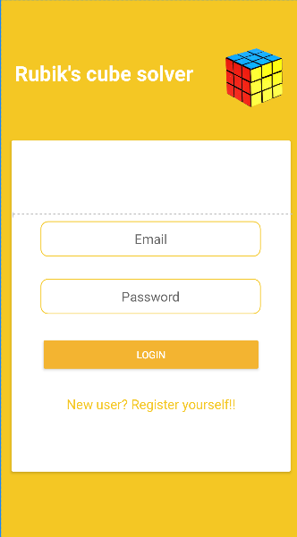
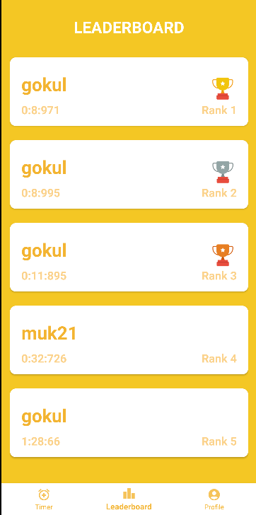

# Rubik's Cube Solver and Social App for Speedcubers

## Table of Contents
- [Introduction](#introduction)
- [Features](#features)
- [Technologies Used](#technologies-used)
- [Installation](#installation)
- [Usage](#usage)
- [Contributing](#contributing)
- [Acknowledgements](#acknowledgements)

## Introduction
This repository contains the source code for a Rubik's Cube solver and a social app designed for speedcubers. The app includes functionalities such as timing solves, generating random scrambles, and verifying solves using a computer vision model. Check the leaderboard of the top 50 solves.




## Features
- **Rubik's Cube Solver**: Detects cube colors using a TensorFlow Lite model and solves the cube.
- **Speedcubing Timer**: Times your solves with millisecond precision.
- **Scramble Generator**: Generates random scrambles for practice.
- **Solve Verification**: Verifies solves using a computer vision model deployed with FastAPI.
- **Social Features**: Allows users to view friends' profiles and check the global leaderboard.
- **User Authentication**: Utilizes Firebase Authentication for secure sign-in.

## Technologies Used
- **Android**: Main platform for the app.
- **TensorFlow Lite**: For cube color detection.
- **FastAPI**: For deploying the computer vision model.
- **Firebase Firestore**: For storing user information.
- **Firebase Authentication**: For user authentication.
- **Ultralytics**: For training the TensorFlow Lite model.
- **Camera2 API**: For accessing the camera in Android.

## Installation
### Prerequisites
- Android Studio
- Python 3.7 or later
- Firebase account

### Steps
1. **Clone the repository**
    ```sh
    git clone https://github.com/your-username/rubiks-cube-solver.git
    cd rubiks-cube-solver
    ```

2. **Set up Firebase**
   - Create a Firebase project in the [Firebase Console](https://console.firebase.google.com/).
   - Add an Android app to your Firebase project.
   - Download the `google-services.json` file and place it in the `app` directory.

3. **Configure FastAPI server**
   - Navigate to the `fastapi_server` directory.
   - Install the required dependencies:
     ```sh
     pip install -r requirements.txt
     ```
   - Run the FastAPI server:
     ```sh
     uvicorn main:app --reload
     ```

4. **Open the project in Android Studio**
   - Open the project in Android Studio.
   - Sync the project with Gradle files.

## Usage
### Running the App
1. Open the app on your Android device.
2. Sign in using your Firebase credentials.
3. Use the camera feature to detect Rubik's Cube colors and solve the cube.
4. Time your solves and generate random scrambles for practice.
5. Verify your solves using the computer vision model.
6. Connect with friends, view profiles, and check the global leaderboard.

## Contributing
Contributions are welcome! Please follow these steps to contribute:
1. Fork the repository.
2. Create a new branch (`git checkout -b feature-branch`).
3. Make your changes.
4. Commit your changes (`git commit -m 'Add some feature'`).
5. Push to the branch (`git push origin feature-branch`).
6. Open a pull request.


## Acknowledgements
- Special thanks to the creators of TensorFlow Lite, FastAPI, and Firebase for their excellent tools.
- Thanks to Ultralytics for providing the training framework.
